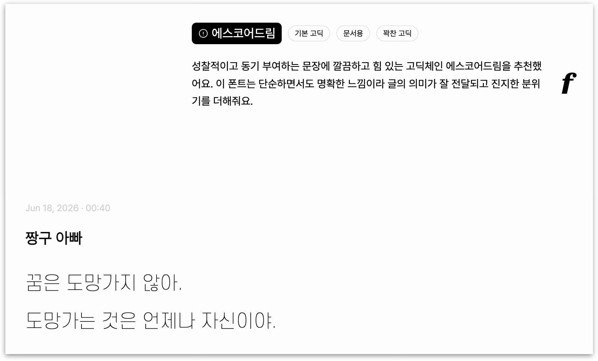
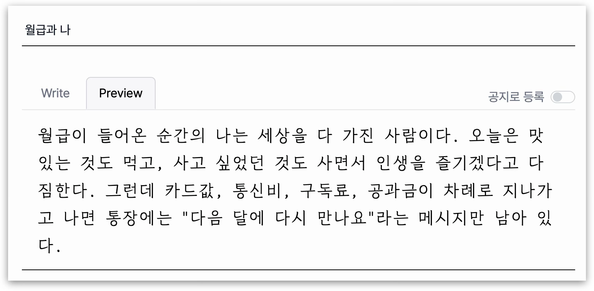
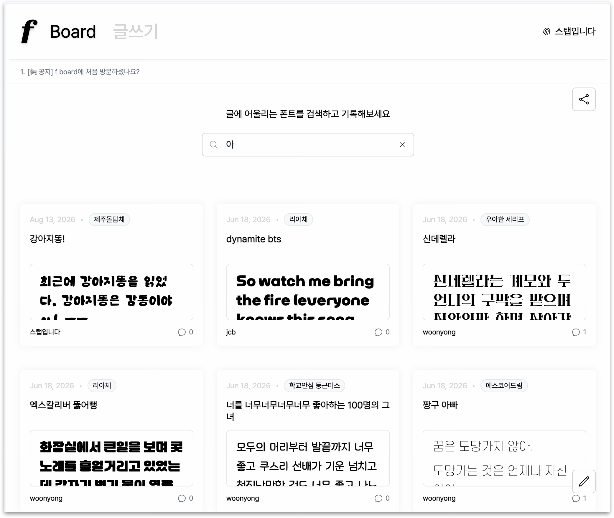

# f-board

글의 분위기를 분석해 어울리는 웹폰트를 추천하고, 추천 이유와 적용 결과를 게시글로 기록하는 AI 폰트 보드입니다.

## 제작 배경

문장의 분위기와 목적에 맞는 폰트를 고르려면 여러 서체를 직접 비교해야 합니다. f-board는 사용자가 작성한 글의 감정과 문체를 분석해 어울리는 폰트를 추천하고, 실제 적용 결과를 미리 본 뒤 게시글로 저장할 수 있도록 만들었습니다.

## 주요 화면

<table>
  <tr>
    <th width="50%">상세 페이지</th>
    <th width="50%">추천 폰트 미리보기</th>
  </tr>
  <tr>
    <td></td>
    <td></td>
  </tr>
</table>

<p align="center"><strong>게시글 목록</strong></p>
<p align="center">
  
</p>

## 사용자 흐름

```text
문장 작성
→ AI 문장 분석
→ 관련 폰트 선택 가이드 검색
→ 실제 폰트 후보 중 하나 선택
→ 추천 이유와 웹폰트 미리보기 제공
→ 게시글 저장
```

## 주요 기능

- 글 내용 기반 AI 폰트 추천 및 추천 이유 제공
- 추천 웹폰트 적용 미리보기
- 게시글 CRUD, 검색, 페이지네이션
- 쿠키 기반 로그인 및 회원가입
- 폰트 출처, 라이선스, 다운로드 정보 팝오버
- 댓글 작성 및 삭제
- 관리자 공지 등록과 공지 ticker
- 마이페이지의 작성 글과 사용 폰트 기록

## AI 추천 흐름

1. 사용자 문장에서 감정, 문체, 시각적 특징, 에너지, 키워드를 추출합니다.
2. 원문과 분석 결과를 임베딩해 ChromaDB에서 관련 폰트 선택 가이드 3개를 검색합니다.
3. 검색된 가이드와 DB의 실제 폰트 후보 정보를 함께 비교해 폰트 하나를 선택합니다.
4. 선택된 폰트의 상세 정보와 추천 이유를 프론트엔드에 반환합니다.

폰트 선택 가이드 61개는 하나의 판단 기준을 하나의 의미 단위로 구성하고, 사전에 임베딩해 ChromaDB에 저장했습니다. 추천 요청 시에는 사용자 입력으로 검색 쿼리만 임베딩합니다.

## 주요 구현

### 동적 웹폰트 적용

추천 API가 반환한 웹폰트 URL을 브라우저가 사용할 `font-family`와 연결하기 위해 `@font-face`를 런타임에 등록했습니다. 폰트별 고유한 이름을 생성하고 동일한 스타일의 중복 등록을 방지하며, 웹폰트 정보가 없을 때는 기본 폰트로 대체합니다.

### 추천 데이터 화면 구조 통합

AI 추천 응답과 저장된 게시글 응답은 각각의 목적에 따라 서로 다른 구조를 사용합니다. 작성 및 수정 미리보기에 필요한 폰트 정보와 추천 이유만 추출해 공통 화면 구조로 변환하고, UI가 데이터 출처와 관계없이 동일한 필드를 사용하도록 구성했습니다.

## 기술 스택

- Frontend: React, JavaScript, Vite, Tailwind CSS
- Backend: Python, FastAPI, SQLModel
- Database: PostgreSQL
- AI/RAG: OpenAI API, ChromaDB
- Test: Vitest, Testing Library

## 폰트 사용 방식

추천 대상 폰트 파일은 저장하거나 재배포하지 않습니다. 폰트명, 출처, 라이선스, 웹폰트 URL 같은 메타데이터만 관리하고, 화면에서는 원격 웹폰트 URL을 `@font-face`로 등록해 미리보기를 제공합니다.

포트폴리오 목적의 학습 프로젝트이며, 실제 브랜드나 상업 프로젝트에 적용하기 전에는 각 폰트의 원 배포처와 라이선스를 다시 확인해야 합니다.
