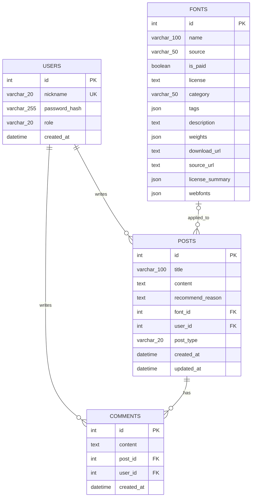

# f-board Database Schema

이 문서는 현재 모델 코드를 기준으로 f-board의 주요 테이블과 관계를 정리한다.
초기 구조는 `fonts`, `posts`, `users`로 시작했으며, 댓글과 관리자 공지 기능을 추가하면서 관계와 콘텐츠 유형을 확장했다.

## 관계도

## 테이블 역할

| 테이블 | 역할 | 주요 관계 |
| --- | --- | --- |
| `users` | 사용자 인증 정보와 권한 저장 | 게시글과 댓글의 작성자 |
| `fonts` | 추천에 사용하는 폰트 메타데이터 저장 | 일반 게시글에 적용된 폰트 |
| `posts` | 추천 결과와 사용자 글, 공지 저장 | 사용자와 폰트 참조, 댓글 소유 |
| `comments` | 게시글에 작성된 댓글 저장 | 게시글과 사용자 참조 |

## 주요 설계 기준

- 사용자, 폰트, 게시글, 댓글을 각각 독립된 엔티티로 두고 외래 키로 연결했다.
- 비밀번호 원문 대신 `password_hash`를 저장한다.
- 닉네임은 로그인 식별에 사용하므로 고유 제약조건을 둔다.
- 제목과 역할처럼 최대 길이가 정해진 값은 `VARCHAR`, 본문과 설명처럼 길이가 유동적인 값은 `TEXT`로 저장한다.
- 태그, 굵기, 웹폰트 정보처럼 배열 또는 구조화된 목록은 `JSON`으로 저장한다.
- 일반 게시글은 폰트를 참조하지만 공지는 고정 서체로 표시하므로 `posts.font_id`는 선택 값이다.
- 관리자 여부는 닉네임 문자열이 아니라 `users.role`로 판단한다.
- 일반 게시글과 공지는 같은 콘텐츠 생명주기를 공유하므로 별도 테이블 대신 `posts.post_type`으로 구분한다.
